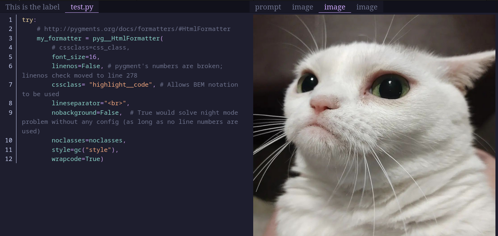

# Anki Code cards
This project is part of [Anki Code](#).

 

## Objective
To have an interface that is familiar to people that code and flexible enough to allow for different uses.
In particular, the main focus is on:
    - Allowing users to navigate the different parts of content quickly
    - Create a UI/UX that is intuitive and familiar
    - Allow for different themes

## Structure
The style files (Style_dev) were built using [SMACSS](http://smacss.com/) methodology and [BEM](https://getbem.com/) nomenclature.
Every module (Style_dev/modules) had its own tests and README for easy understanding of how they work and can be used.
The compiled CSS has been minified to make for better loading times.

To have a better feeling for how cards look (and for testing purposes), "main_test.html" shows how cards will render in Anki, using test entries.

The final HTML file can't be rendered correctly in the browser as it contains Anki-specific syntax. 

## What could be better
- As of now, to account for different themes, every module has hard-coded variables inside of them.
- The navigation is also not-accessible for people that do not have a mouse (Keyboard shortcuts could also conflict with Anki's).

### Inspired by:
- [VScode](https://code.visualstudio.com/)
- [Catppuccin project](https://github.com/catppuccin)
- [Dracula theme](https://draculatheme.com/highlightjs)
[in construction]

##### Test Images:
I do not own any of the test images that have been used. 
These are the sources where they can be found:
- [Ghosts](https://www.youtube.com/watch?v=kXF3VYYa5TI): Louie Zong (Youtube channel)
- [Widget the cat](https://www.instagram.com/p/CkribpgLiHu/): @widgetthemidget2020 (Instagram account)
- [Lime the frog](https://www.instagram.com/p/Cktf5HFvufL/): @limethefrog (Instagram account)