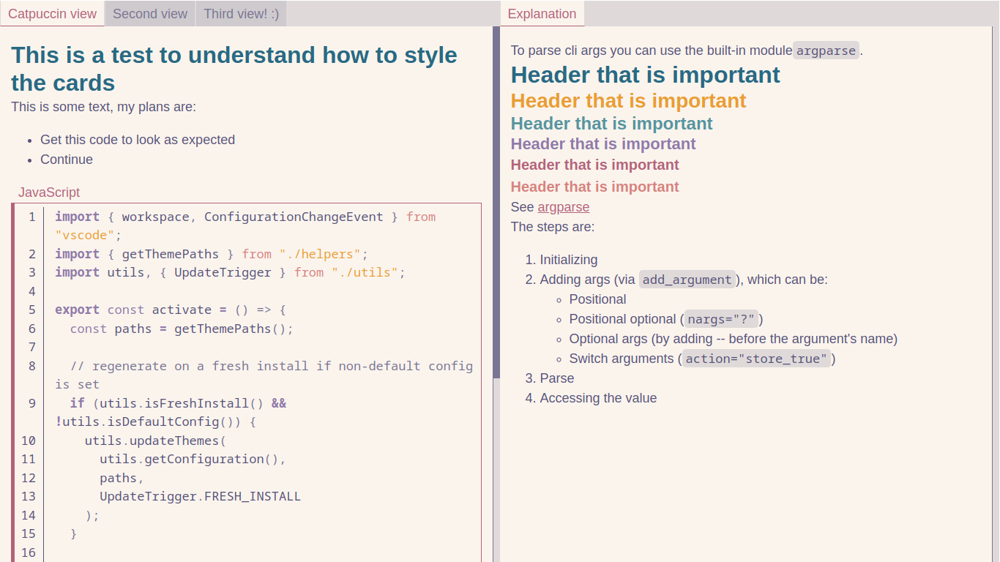
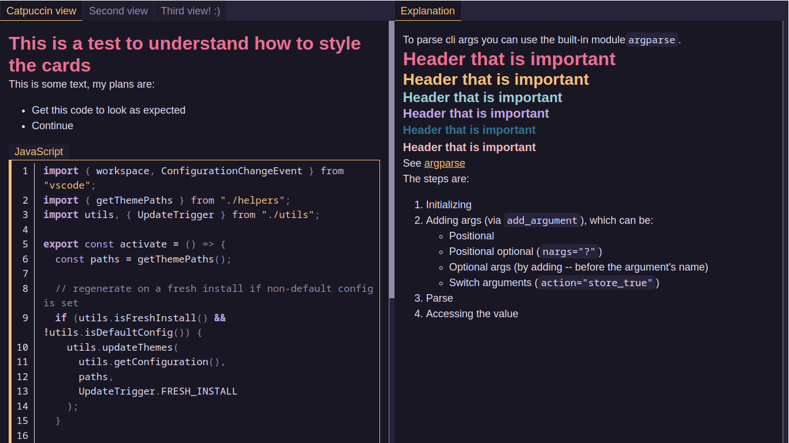
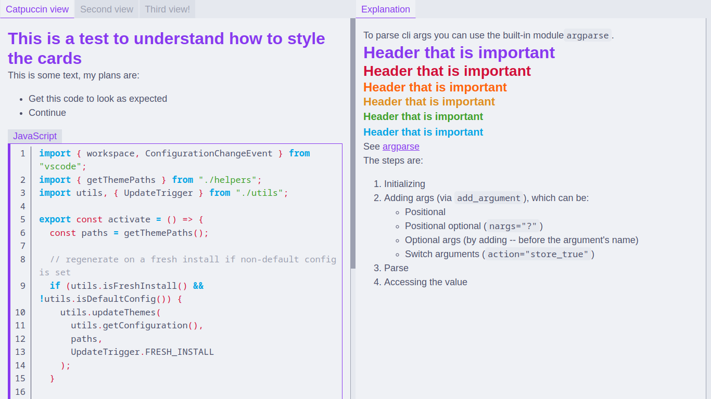

# Markdown2anki themes

## Table of contents

**Dual themes**

- [Rose Pine and Dawn](#Rose-Pine-and-Dawn)
- [Catpuccin Latte and Macchiato](#Catpuccin-Latte-and-Macchiato)
- [Tokyo Night Day and Storm](#Tokyo-Night-Day-and-Storm)

All dual themes are also available in individual Light and Dark versions.

## Rose Pine and Dawn

### Rose Pine Dawn

Inspired by: https://rosepinetheme.com/

### Rose Pine

Inspired by: https://rosepinetheme.com/

## Catpuccin Latte and Macchiato

### Catpuccin Latte

Inspired by: https://github.com/catppuccin/catppuccin

## Tokyo Night Day and Storm

Inspired by: https://github.com/tokyo-night/tokyo-night-vscode-theme

## Tokyo Night Day

## Tokyo Night Storm

